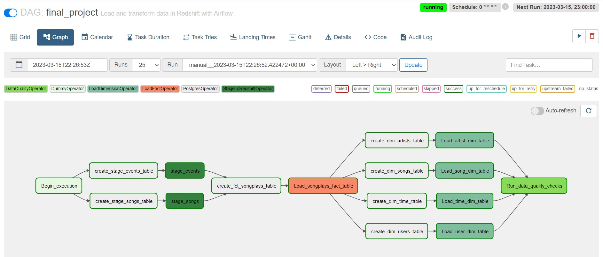

# kerry-udacity-airflow-data-pipeline

## Summary

This github contains working files completed on the Udacity Workspace.
Since at the time of the project, workspace submission is not available, so I was instructed to upload these project files to my own project repo.

This project aims to take completed ETL work to the next stage: automated pipelines for the Sparkify app.

## Pipeline
The pipeline includes the following stage:
- loading data to staging tables
- derive fact and dimension tables from the staging tables
- running data quality checks to ensure data integrity

## Custom Operators
### Stage Operator

The stage operator is expected to be able to load any JSON formatted files from S3 to Amazon Redshift. The operator creates and runs a SQL COPY statement based on the parameters provided. The operator's parameters should specify where in S3 the file is loaded and what is the target table.

The parameters should be used to distinguish between JSON file. Another important requirement of the stage operator is containing a templated field that allows it to load timestamped files from S3 based on the execution time and run backfills.

### Fact and Dimension Operators

With dimension and fact operators, you can utilize the provided SQL helper class to run data transformations. Most of the logic is within the SQL transformations and the operator is expected to take as input a SQL statement and target database on which to run the query against. You can also define a target table that will contain the results of the transformation.

Dimension loads are often done with the truncate-insert pattern where the target table is emptied before the load. Thus, you could also have a parameter that allows switching between insert modes when loading dimensions. Fact tables are usually so massive that they should only allow append type functionality.

### Data Quality Operator

The final operator to create is the data quality operator, which is used to run checks on the data itself. The operator's main functionality is to receive one or more SQL based test cases along with the expected results and execute the tests. For each the test, the test result and expected result needs to be checked and if there is no match, the operator should raise an exception and the task should retry and fail eventually.

For example one test could be a SQL statement that checks if certain column contains NULL values by counting all the rows that have NULL in the column. We do not want to have any NULLs so expected result would be 0 and the test would compare the SQL statement's outcome to the expected result.

## Final DAG RUN Graph on Airflow
Please note that, I decided to separate out the CREATE table tasks before the loading tasks
Therefore, the final DAG would look like the following:

